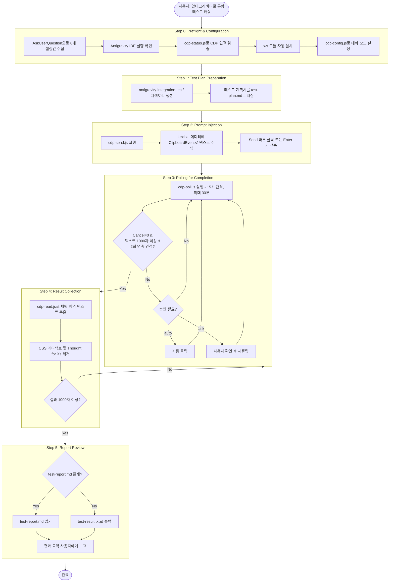

# Skills

Claude Code 커스텀 스킬 모듈 모음입니다.

## 등록 방법

레포지토리 루트에서 등록 스크립트를 실행하면 인터랙티브 TUI로 스킬을 선택하여 `~/.claude/skills/`에 복사합니다.
스킬 시스템에 대한 자세한 내용은 [Claude Code 공식 문서 - Skills](https://docs.anthropic.com/en/docs/claude-code/skills)를 참고하세요.

```bash
# Linux/Mac/Git Bash
./register-skills.sh

# Windows PowerShell
.\register-skills.ps1
```

---

<summary><h2>antigravity-test-runner</h2>Google Antigravity IDE의 Browser Subagent를 CDP로 제어하여 웹 프로젝트 통합테스트 자동화</summary>
<details>

### 파일 구조

```
antigravity-test-runner/
├── .claude-plugin/
│   └── plugin.json                          # 스킬 메타데이터 (name, version, description)
└── skills/
    └── antigravity-integration-test/
        ├── SKILL.md                         # 스킬 정의 (트리거, 설정, 워크플로우)
        ├── scripts/                         # CDP 통신 Node.js 스크립트
        │   ├── cdp-client.js                #   공용 CDP 클라이언트 라이브러리
        │   ├── cdp-status.js                #   연결 상태 확인 (preflight)
        │   ├── cdp-config.js                #   대화 모드/모델 변경
        │   ├── cdp-send.js                  #   프롬프트 주입 및 전송
        │   ├── cdp-poll.js                  #   완료 감지 폴링 + 승인 처리
        │   ├── cdp-approve.js               #   수동 승인 버튼 클릭
        │   ├── cdp-read.js                  #   채팅 결과 추출
        │   ├── package.json                 #   의존성 (ws ^8.19.0)
        │   └── node_modules/ws/             #   WebSocket 라이브러리
        ├── steps/                           # 6단계 워크플로우 정의
        │   ├── step-0-preflight.md          #   사전 점검 및 설정 수집
        │   ├── step-1-test-plan.md          #   테스트 계획서 작성
        │   ├── step-2-inject.md             #   프롬프트 주입
        │   ├── step-3-poll.md               #   완료 대기 폴링
        │   ├── step-4-read.md               #   결과 수집
        │   └── step-5-report.md             #   리포트 검토
        └── references/                      # 참조 문서
            ├── cdp-protocol.md              #   CDP 프로토콜 가이드
            ├── test-plan-template.md        #   테스트 계획서 템플릿
            ├── test-plan-batch-template.md  #   배치 테스트 계획서 템플릿
            ├── test-report-template.md      #   테스트 리포트 템플릿
            └── troubleshooting.md           #   트러블슈팅 가이드
```

### 요구사항

- [**Node.js**](https://nodejs.org/) (v14 이상)
- **Google Antigravity IDE** (Chrome DevTools Protocol 지원)
- **ws** npm 패키지 (scripts/ 내 번들 포함)
- **http-server** 또는 유사한 로컬 서버 (테스트 대상 서빙용)

### 사용자 설정 항목

스킬 실행 시 Step 0에서 아래 8개 설정을 대화형으로 수집합니다.

| 설정 | 기본값 | 설명 |
|------|--------|------|
| CDP Port | `9222` | Antigravity IDE의 원격 디버깅 포트 |
| Test URL | `http://localhost:8080` | 테스트 대상 URL |
| Conversation Mode | `planning` | Antigravity 대화 모드 (`planning` / `fast`) |
| Test Plan Format | `template` | 테스트 계획서 형식 (`template` / `custom`) |
| Project Root | `.` | 프로젝트 루트 경로 |
| Screenshot Resolution | `auto` | 스크린샷 해상도 (`auto` / `1920x1080` / 직접 입력) |
| Approval Handling | `ask` | 승인 처리 방식 (`auto` / `ask` / `manual`) |
| Approval Beeping | `disable` | 승인 필요 시 비프음 (`enable` / `disable`) |

### 실행 Flow (6단계 워크플로우)



### CDP 스크립트 상세

| 스크립트 | 역할 | 주요 옵션 |
|----------|------|-----------|
| `cdp-client.js` | 공용 라이브러리. CDP 연결, JSON-RPC 통신, JS 평가 | `port` (기본 9222) |
| `cdp-status.js` | 연결 상태 확인. exit 0=성공, 1=재시도, 2=실패 | `--json`, `--port` |
| `cdp-config.js` | 대화 모드(Planning/Fast) 및 모델 변경 | `--mode`, `--model`, `--list` |
| `cdp-send.js` | Lexical 에디터에 프롬프트 주입 후 전송 | `--port`, `--prompt` |
| `cdp-poll.js` | 완료 감지 폴링 + 승인 처리 | `--auto-approve`, `--exit-on-approve`, `--beep` |
| `cdp-approve.js` | "Always run"/"Always Allow" 버튼 클릭 | `--port` |
| `cdp-read.js` | 채팅 영역 텍스트 추출 및 정제 | `--max-length`, `--output` |

### 핵심 기술 패턴

- **Lexical Editor**: Antigravity의 React 기반 에디터. `[data-lexical-editor]` 셀렉터로 탐지하고 마지막(하단) 에디터를 채팅 입력으로 사용
- **ClipboardEvent 주입**: `execCommand`나 `Input.insertText`가 동작하지 않아 `ClipboardEvent('paste')`로 텍스트 삽입
- **완료 감지**: Cancel 버튼 수 + 텍스트 길이 안정성을 조합한 다중 조건 판정
- **승인 모드 3종**: 보안 수준에 따라 자동/확인/수동 중 선택 가능

</details>
